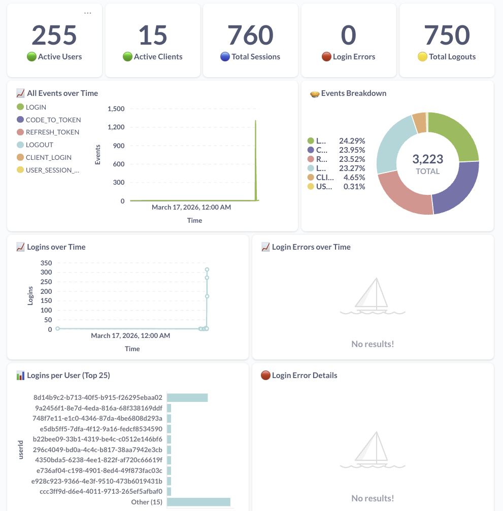
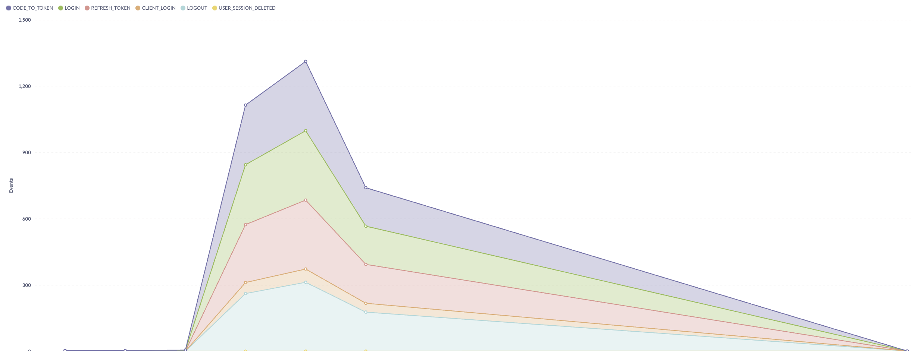

# Keycloak Real-Time Event Analytics — Proof of Concept

> **Stream every Keycloak authentication event into ClickHouse, analyse it in real time, and visualise it with Metabase — all with a single `docker compose up`.**

---

## Table of Contents

1. [Overview](#overview)
2. [Architecture](#architecture)
3. [Why This Stack?](#why-this-stack)
   - [Apache Kafka & the Keycloak Kafka Listener](#apache-kafka--the-keycloak-kafka-listener)
   - [ClickHouse — The Analytics Engine](#clickhouse--the-analytics-engine)
   - [Metabase — Dashboards for Everyone](#metabase--dashboards-for-everyone)
4. [Project Structure](#project-structure)
5. [Automation Scripts](#automation-scripts)
   - [init.sql — Kafka → ClickHouse Pipeline](#initsql--kafka--clickhouse-pipeline)
   - [loader.py — Realm & Dataset Provisioner](#loaderpy--realm--dataset-provisioner)
   - [simulator.py — Realistic Traffic Generator](#simulatorpy--realistic-traffic-generator)
   - [setup_dashboard.py — Metabase Auto-Configurator](#setup_dashboardpy--metabase-auto-configurator)
6. [Dashboard Overview](#dashboard-overview)
7. [Getting Started](#getting-started)
8. [Useful Commands](#useful-commands)
9. [Configuration Reference](#configuration-reference)
10. [Acknowledgements](#acknowledgements)

---

## Overview

Identity providers such as Keycloak generate a continuous stream of high-value events:
logins, failed authentication attempts, token refreshes, logouts, admin operations, client
registrations, and more.  Most deployments either ignore these events entirely or write
them to a relational database that quickly becomes a bottleneck at scale.

This POC demonstrates an **event-driven analytics pipeline** built entirely on open-source
components that answers questions such as:

- How many **distinct users** authenticated in the last hour, broken down by realm?
- Which realms or clients experience the highest **login failure rate**?
- What is the **token refresh vs. login ratio** over time — a proxy for session health?
- Are there **suspicious IP addresses** attempting to brute-force accounts?
- How do **admin operations** (realm changes, user management) evolve over time?

All of this is achieved without modifying Keycloak's core, without polling a database, and
with **sub-second latency** from event generation to dashboard update.

---

## Architecture

```
┌─────────────────────────────────────────────────────────────────────────┐
│                          Keycloak  (port 8443)                          │
│                                                                         │
│   Authentication Events ──► SPI Event Listener (keycloak-kafka.jar)    │
└──────────────────────────────────────┬──────────────────────────────────┘
                                       │  JSON messages
                                       ▼
┌─────────────────────────────────────────────────────────────────────────┐
│                       Apache Kafka  (port 9092)                         │
│                                                                         │
│   Topic: keycloak-events        Topic: keycloak-admin-events            │
└──────────┬──────────────────────────────────────────────────────────────┘
           │  Kafka Engine (native consumer)
           ▼
┌─────────────────────────────────────────────────────────────────────────┐
│                     ClickHouse  (port 8123 / 9000)                      │
│                                                                         │
│   keycloak_events_kafka  ──► Materialized View ──► keycloak_events      │
│   keycloak_admin_events_kafka  ──► MV ──► keycloak_admin_events         │
│                                                                         │
│   Pre-built analytical views: events_per_day, active_users_per_day,     │
│   login_failures, token_stats, …                                        │
└──────────┬──────────────────────────────────────────────────────────────┘
           │  HTTP SQL API
           ▼
┌─────────────────────────────────────────────────────────────────────────┐
│                      Metabase  (port 3000)                              │
│                                                                         │
│   Interactive dashboard with date-range & realm filters:                │
│   KPIs · Time-series · Bar charts · Pie charts · Tables · Row charts    │
└─────────────────────────────────────────────────────────────────────────┘
```

Supporting services:

| Service | Role |
|---|---|
| **kafka-ui** (port 8080) | Browse Kafka topics and inspect raw messages |
| **dataset-loader** | Provision test realms / clients / users via the Keycloak Benchmark Dataset API and enable the Kafka listener on every realm |
| **traffic-simulator** | Replay realistic authentication flows (PKCE, refresh, logout, client_credentials) against every realm and user |
| **metabase-setup** | Auto-configure the ClickHouse connection and deploy the dashboard at startup |

---

## Why This Stack?

### Apache Kafka & the Keycloak Kafka Listener

**Apache Kafka** acts as the central event bus between Keycloak and the analytics layer.

Key advantages in this context:

| Feature | Benefit |
|---|---|
| **Decoupling** | Keycloak writes events fire-and-forget; the analytics layer can be restarted, upgraded, or replaced without affecting authentication. |
| **Durability** | Events are persisted on disk with configurable retention. A ClickHouse outage does not cause data loss — events accumulate in Kafka until they are consumed. |
| **Fan-out** | Multiple consumers (ClickHouse, SIEM, alerting, ML pipelines) can independently consume the same stream without duplicating the producer logic. |
| **Backpressure isolation** | A spike in login traffic does not propagate into the analytics database; Kafka absorbs the burst. |
| **Replayability** | Historical events can be re-consumed from any offset, enabling retroactive schema migrations or backfilling new analytics tables. |

The **`keycloak-kafka.jar`** extension is a Keycloak SPI (Service Provider Interface)
implementation of the `EventListenerProvider` interface. Once registered and enabled on a
realm, it serialises every `Event` and `AdminEvent` to JSON and produces them to the
configured Kafka topics — with zero code changes to Keycloak itself.

```
KAFKA_TOPIC:             keycloak-events        # user events (LOGIN, LOGOUT, …)
KAFKA_ADMIN_TOPIC:       keycloak-admin-events  # admin events (CREATE_USER, …)
KAFKA_BOOTSTRAP_SERVERS: kafka:29092
```

The listener is enabled programmatically on every provisioned realm through the
Keycloak Admin REST API by `loader.py`:

```python
PUT /admin/realms/{realm}
{
  "eventsListeners":    ["jboss-logging", "kafka"],
  "eventsEnabled":      true,
  "adminEventsEnabled": true
}
```

---

### ClickHouse — The Analytics Engine

**ClickHouse** is a column-oriented OLAP database designed for analytical workloads.
It is not a general-purpose database — it is purpose-built for exactly this use case:
aggregating and querying millions of time-series events at interactive speed.

Why ClickHouse over a traditional RDBMS (PostgreSQL, MySQL) for this scenario:

| Dimension | Traditional RDBMS | ClickHouse |
|---|---|---|
| **Ingestion throughput** | Thousands of rows/s (single-row INSERTs are expensive) | Millions of rows/s (columnar batch writes) |
| **Aggregation speed** | Full table scans are slow at scale | Compressed column storage, vectorised execution — sub-second on 100M rows |
| **Kafka integration** | Requires a separate connector (Debezium, Kafka Connect) | Native **Kafka engine table** — ClickHouse IS the consumer |
| **Storage efficiency** | Row storage + B-Tree indexes | LZ4/ZSTD columnar compression — 5-10× smaller on event data |
| **Concurrent analytical queries** | Degrades rapidly under load | Designed for high-concurrency analytics |
| **Maintenance** | Partitioning / vacuuming / index management needed | Managed via `MergeTree` engine automatically |

The pipeline in this POC uses three ClickHouse primitives:

1. **Kafka Engine table** — a virtual table that acts as a native Kafka consumer group.
   No external connector required.
   ```sql
   CREATE TABLE keycloak_events_kafka ( … )
   ENGINE = Kafka()
   SETTINGS kafka_broker_list = 'kafka:29092',
            kafka_topic_list  = 'keycloak-events',
            kafka_format      = 'JSONEachRow';
   ```

2. **MergeTree table** — the durable analytical store, partitioned by month and ordered
   by `(realmId, type, event_time)` to optimise the most common query patterns.

3. **Materialized View** — continuously moves rows from the Kafka engine table into the
   MergeTree table the moment they are consumed, converting the raw Unix millisecond
   timestamp into a proper `DateTime64(3)`.
   ```sql
   CREATE MATERIALIZED VIEW keycloak_events_mv TO keycloak_events AS
   SELECT …, fromUnixTimestamp64Milli(`time`) AS event_time
   FROM keycloak_events_kafka;
   ```

Pre-built **analytical views** shipped with `init.sql`:

| View | Description |
|---|---|
| `events_per_day` | Event counts grouped by day, type, and realm |
| `active_users_per_day` | Distinct authenticated users per day per realm |
| `login_failures` | Login error counts per user, client, and IP address |

---

### Metabase — Dashboards for Everyone

**Metabase** is an open-source business intelligence platform that allows both technical
and non-technical stakeholders to explore data and build dashboards without writing SQL.

Why Metabase in this POC:

- **Zero SQL required** for end users — drag-and-drop question builder on top of
  ClickHouse tables and views.
- **Native ClickHouse driver** — the official `clickhouse.metabase-driver.jar` plugin
  is automatically downloaded and installed at container startup.
- **Interactive filters** — the dashboard ships with a `Date Range` filter and a `Realm`
  filter wired to every card, enabling instant drill-down without page reloads.
- **Embeddable** — dashboards can be embedded in external portals via signed URLs.
- **Automated setup** — `setup_dashboard.py` configures the database connection and
  deploys all dashboard cards programmatically via the Metabase REST API, so the
  dashboard is ready the moment the stack starts.

---

## Project Structure

```
keycloak-reporting/
├── docker-compose.yml              # Full stack definition
│
├── keycloak/
│   ├── keycloak-kafka.jar          # Kafka SPI event listener extension
│   ├── keycloak-benchmark-dataset.jar  # Dataset provider extension
│   ├── spiffe-realm.json           # Optional: pre-configured realm import
│   └── ssl/                        # TLS certificates for Keycloak HTTPS
│
├── clickhouse/
│   └── init.sql                    # Kafka engine + MergeTree + Materialized Views
│
├── dataset-loader/
│   ├── Dockerfile
│   └── loader.py                   # Realm/client/user provisioner
│
├── traffic-simulator/
│   ├── Dockerfile
│   └── simulator.py                # Authentication traffic generator
│
└── metabase/
    ├── Dockerfile
    └── setup_dashboard.py          # Metabase auto-configurator
```

---

## Automation Scripts

### `init.sql` — Kafka → ClickHouse Pipeline

**Location:** `clickhouse/init.sql`  
**Executed by:** ClickHouse at container startup via `/docker-entrypoint-initdb.d/`

This SQL script bootstraps the entire ingestion pipeline without any external connector:

```
Kafka topic: keycloak-events
      │
      ▼  Kafka Engine table (virtual consumer)
keycloak_events_kafka
      │
      ▼  Materialized View (continuous transform)
keycloak_events_mv
      │
      ▼  MergeTree table (persistent, indexed, queryable)
keycloak_events
```

The same pattern is applied to `keycloak-admin-events`.

Three ready-to-use analytical views (`events_per_day`, `active_users_per_day`,
`login_failures`) are created on top of the MergeTree table.

---

### `loader.py` — Realm & Dataset Provisioner

**Location:** `dataset-loader/loader.py`  
**Runs as:** a Docker Compose service (`dataset-loader`)

This script automates the full provisioning lifecycle:

1. **Waits** for Keycloak to become healthy.
2. **Creates** `REALM_COUNT` realms, each populated with `CLIENTS_PER_REALM` confidential
   clients and `USERS_PER_REALM` users via the Keycloak Benchmark Dataset API:
   ```
   GET /realms/master/dataset/create-realms
       ?count=5&clients-per-realm=10&users-per-realm=50
   ```
3. **Enables** the Kafka event listener on every newly created realm via the Admin REST API:
   ```
   PUT /admin/realms/{realm}
   { "eventsListeners": ["jboss-logging", "kafka"], "eventsEnabled": true }
   ```
   It waits for each realm to be fully available (via its `/.well-known/openid-configuration`
   endpoint) before attempting the configuration, avoiding race conditions.
4. **On shutdown** (SIGTERM/SIGINT): automatically removes all created realms, keeping the
   environment clean between test runs.

Key environment variables:

| Variable | Default | Description |
|---|---|---|
| `REALM_COUNT` | `5` | Number of test realms to create |
| `CLIENTS_PER_REALM` | `10` | Confidential clients per realm |
| `USERS_PER_REALM` | `50` | Users per realm |
| `KAFKA_EVENT_LISTENER` | `kafka` | SPI listener ID from `keycloak-kafka.jar` |

---

### `simulator.py` — Realistic Traffic Generator

**Location:** `traffic-simulator/simulator.py`  
**Runs as:** a Docker Compose service (`traffic-simulator`)

The simulator generates realistic, multi-threaded authentication traffic across all
provisioned realms, clients, and users. It exercises every major OAuth 2.0 / OIDC grant
type supported by Keycloak:

**User flow (Authorization Code + PKCE S256):**

```
1. GET  /auth  →  obtain login page + session cookies
2. POST login form  →  302 redirect with authorization code
3. POST /token  →  exchange code for access + refresh token  (code_verifier)
4. POST /token  →  refresh the access token
5. POST /logout →  revoke the session
```

> PKCE (RFC 7636) with the S256 method is used by default, matching the security
> requirements of Keycloak 24+ public clients.

**Client flow (Client Credentials):**

```
1. POST /token  →  obtain access token (grant_type=client_credentials)
2. POST /token  →  refresh (if the server issues a refresh token)
```

Additional features:
- **Deterministic per-user IP and User-Agent** — every user gets a unique, reproducible
  source IP (`10.<realm>.<slot/256>.<slot%256>`) and browser fingerprint, making IP-based
  analytics meaningful.
- **Thread-safe statistics** — counters are protected by a `threading.Lock` and printed
  after each iteration.
- **Configurable naming patterns** — adapt to any dataset provider via
  `USER_NAME_PATTERN`, `USER_PASS_PATTERN`, `CLIENT_ID_PATTERN`.
- **Global vs. per-realm user indexing** — `USER_INDEX_GLOBAL=true` supports dataset
  providers that use a global sequential counter across realms.
- **Infinite loop with configurable delay** — set `LOOP_COUNT=0` for continuous traffic.

---

### `setup_dashboard.py` — Metabase Auto-Configurator

**Location:** `metabase/setup_dashboard.py`  
**Runs as:** a Docker Compose service (`metabase-setup`)

This script fully automates Metabase onboarding via the Metabase REST API:

1. **Waits** for Metabase to be healthy.
2. **Creates** the admin account (first-run setup).
3. **Configures** the ClickHouse database connection using the official driver.
4. **Deploys** a comprehensive dashboard with the following cards:

| Category | Cards |
|---|---|
| **KPIs** | Active users, Active clients, Total sessions, Total events |
| **Login activity** | Logins over time, Login errors over time, Login error rate |
| **Token activity** | Tokens by grant type, Refresh tokens by client, Code exchanges |
| **Session activity** | Sessions per user, Sessions per client |
| **Logout activity** | Logouts over time |
| **Admin events** | Admin operations by type, Resource modifications over time |
| **Filters** | Date range + Realm — wired to every card |

All cards use native SQL queries with `{{date_from}}`, `{{date_to}}`, and `{{realm}}`
template variables, enabling live filtering directly from the dashboard.

---

## Dashboard Overview

Once the stack is running, open **http://localhost:3000** and log in with:

```
Email:    admin@keycloak.local
Password: Admin123!
```

The **Keycloak Events Dashboard** is pre-created and ready to use.

Key panels:

```
┌──────────────┬──────────────┬──────────────┬──────────────┐
│ Active Users │ Active Clients│  Sessions    │ Total Events │  ← KPI scalars
└──────────────┴──────────────┴──────────────┴──────────────┘
┌────────────────────────────┬─────────────────────────────┐
│   Logins over Time (line)  │  Login Errors over Time     │  ← Time series
└────────────────────────────┴─────────────────────────────┘
┌────────────────────────────┬─────────────────────────────┐
│ Tokens by Grant Type (bar) │  Sessions per Client (row)  │
└────────────────────────────┴─────────────────────────────┘
┌────────────────────────────────────────────────────────────┐
│         Admin Operations by Resource Type (pie)            │
└────────────────────────────────────────────────────────────┘
```

Use the **Date Range** and **Realm** filters at the top to drill down into any
time window or specific realm.

---

## Getting Started

### Prerequisites

- Docker Desktop ≥ 4.x with Docker Compose v2
- At least **4 GB of RAM** allocated to Docker
- Port availability: `8443`, `8080`, `3000`, `9000`, `9092`, `8123`

### Add the Keycloak hostname to `/etc/hosts`

```bash
echo "127.0.0.1  localhost.idyatech.fr" | sudo tee -a /etc/hosts
```

### Start the full stack

```bash
cd keycloak-reporting
docker compose up --build
```

The startup sequence is fully automated:

```
1. kafka          → healthy
2. clickhouse     → healthy  (runs init.sql — creates Kafka engine + MergeTree tables)
3. keycloak       → healthy  (loads keycloak-kafka.jar + keycloak-benchmark-dataset.jar)
4. dataset-loader → starts   (creates realms, enables Kafka listener on each realm)
5. traffic-simulator → starts (begins authentication flows across all realms)
6. metabase       → healthy  (downloads ClickHouse driver)
7. metabase-setup → starts   (configures ClickHouse connection + deploys dashboard)
```

### Verify the pipeline end-to-end

```bash
# 1. Check Kafka topics receive events
docker exec kafka-test-client /opt/kafka/bin/kafka-console-consumer.sh \
  --bootstrap-server kafka:29092 \
  --topic keycloak-events \
  --from-beginning \
  --max-messages 5

# 2. Check ClickHouse ingested the events
docker exec clickhouse clickhouse-client --password clickhouse --query \
  "SELECT type, realmId, count() AS n FROM keycloak.keycloak_events GROUP BY type, realmId ORDER BY n DESC FORMAT Pretty"

# 3. Open Metabase dashboard
open http://localhost:3000/dashboard/2


# 4. Browse raw Kafka messages
open http://localhost:8080
```



---

## Useful Commands

### Query ClickHouse directly

```bash
# Interactive client
docker exec -it clickhouse clickhouse-client --password clickhouse --database keycloak

# One-liner: active users per realm
docker exec clickhouse clickhouse-client --password clickhouse --query \
  "SELECT realmId, uniqExact(userId) AS users FROM keycloak.keycloak_events \
   WHERE type='LOGIN' GROUP BY realmId ORDER BY realmId FORMAT Pretty"

# Full analytics summary
docker exec clickhouse clickhouse-client --password clickhouse --query "
SELECT
    realmId,
    uniqExact(userId)            AS distinct_users,
    uniqExact(clientId)          AS distinct_clients,
    uniqExact(sessionId)         AS distinct_sessions,
    countIf(type='LOGIN')        AS logins,
    countIf(type='LOGIN_ERROR')  AS login_errors,
    countIf(type='LOGOUT')       AS logouts,
    countIf(type='REFRESH_TOKEN') AS refreshes,
    countIf(type='CLIENT_LOGIN') AS client_logins
FROM keycloak.keycloak_events
GROUP BY realmId ORDER BY realmId
FORMAT Pretty"
```

### Stop and clean up

```bash
# Stop all services (dataset-loader will remove all test realms automatically)
docker compose down

# Full cleanup (remove all volumes — deletes ClickHouse data, Metabase config)
docker compose down -v
```

### Rebuild a single service

```bash
docker compose up --build dataset-loader
docker compose up --build traffic-simulator
```

---

## Configuration Reference

### `dataset-loader` service

| Variable | Default | Description |
|---|---|---|
| `REALM_COUNT` | `5` | Realms to provision |
| `CLIENTS_PER_REALM` | `10` | Clients per realm |
| `USERS_PER_REALM` | `50` | Users per realm |
| `KAFKA_EVENT_LISTENER` | `kafka` | Listener SPI ID (`kafka` or `event-listener-kafka`) |

### `traffic-simulator` service

| Variable | Default | Description |
|---|---|---|
| `CONCURRENCY` | `4` | Parallel threads per realm |
| `LOOP_COUNT` | `3` | Iterations (`0` = infinite) |
| `LOOP_DELAY` | `5` | Seconds between iterations |
| `USER_INDEX_GLOBAL` | `false` | Use global user index across realms |
| `USER_NAME_PATTERN` | `user-{i}` | Username format |
| `USER_PASS_PATTERN` | `user-{i}-password` | Password format |
| `CLIENT_ID_PATTERN` | `client-{i}` | Client ID format |

---

## Acknowledgements

This POC would not have been possible without the outstanding work of the Keycloak community:

### [keycloak-benchmark-dataset](https://github.com/keycloak/keycloak-benchmark)
> The official Keycloak Benchmark project maintained by the Red Hat / Keycloak team.  
> The `keycloak-benchmark-dataset.jar` extension exposes a Dataset Provider REST API
> that allows bulk creation of realms, clients, and users in seconds — an invaluable
> tool for performance testing and POC environments.

### [keycloak-kafka](https://github.com/SnuK87/keycloak-kafka)
> A community Keycloak SPI extension by **SnuK87** that implements a Kafka
> `EventListenerProvider`. It bridges the gap between Keycloak's internal event system
> and the Kafka ecosystem with minimal configuration — just drop the JAR into the
> providers directory and set three environment variables.

Both extensions are used as-is, without modification, demonstrating the power of Keycloak's
SPI architecture and the quality of its community contributions.

---

*Built with ❤️ using Keycloak · Apache Kafka · ClickHouse · Metabase*

